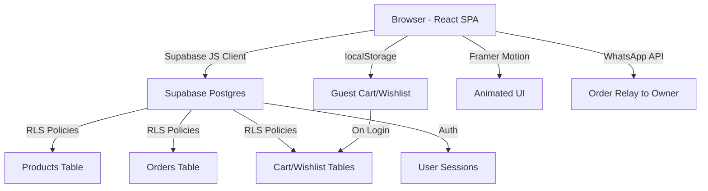
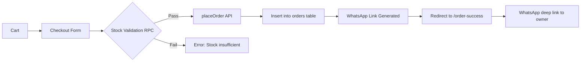

# Scrunch & Create — Shopify Migration Audit Report

> **Date:** 2026-08-25
> **Prepared by:** Engineering Agent
> **Mediator:** Danish (Human)
> **Status:** AUDIT COMPLETE — Awaiting AI Technical Lead Review

---

## Table of Contents

1. [Executive Summary](#1-executive-summary)
2. [Technology Stack Inventory](#2-technology-stack-inventory)
3. [Repository & Architecture Map](#3-repository--architecture-map)
4. [Data Model & Schema Analysis](#4-data-model--schema-analysis)
5. [UI Component → Liquid Section Mapping](#5-ui-component--liquid-section-mapping)
6. [Business Logic Audit](#6-business-logic-audit)
7. [Asset & Media Inventory](#7-asset--media-inventory)
8. [Third-Party Integrations](#8-third-party-integrations)
9. [SEO & Routing Analysis](#9-seo--routing-analysis)
10. [Production Readiness Assessment](#10-production-readiness-assessment)
11. [MCP Tooling Status](#11-mcp-tooling-status)
12. [Risk Register & Migration Recommendations](#12-risk-register--migration-recommendations)

---

## 1. Executive Summary

**Scrunch & Create** is a handmade hair accessories brand operating from India, currently running a **React 19 + Vite 7 SPA** deployed on **Vercel**, with **Supabase** as the primary backend (Auth, Postgres DB, RLS policies). The storefront sells scrunchies, hair bows, hair clips, earrings, flower jewellery, paraandis, combos, and gift hampers.

### Key Findings

| Dimension | Current State | Migration Impact |
|-----------|--------------|-----------------|
| **Frontend** | React SPA with CSS Modules + Framer Motion | Full rewrite to Shopify Liquid + theme JS |
| **Backend** | Supabase (Postgres + Auth + RLS) | Replace with Shopify Admin API + native features |
| **Cart** | Custom React Context + localStorage fallback | Replace with Shopify Cart API |
| **Checkout** | Custom single-page checkout with pincode auto-fill | Replace with Shopify Checkout (native) |
| **Auth** | Supabase Auth (email/password) | Replace with Shopify Customer Accounts |
| **Payments** | Simulated (UPI/Card/COD forms, WhatsApp order relay) | Replace with Shopify Payments / Razorpay |
| **Products** | ~8 categories, variants by color, JSONB storage | Migrate to Shopify Products + Variants |
| **Pricing** | Hard-coded pricing engine in `pricing.js` | Migrate to Shopify variant pricing + compare-at prices |
| **Inventory** | Atomic stock decrement RPC in Supabase | Replace with Shopify Inventory Management |
| **Coupons** | Hard-coded coupon config (`coupons.js`) | Migrate to Shopify Discount Codes |

### Critical Observations

> [!WARNING]
> The live site exhibits **client-side interactivity failures** in the browser audit — variant selection, quantity changes, and add-to-cart clicks were non-functional during testing. This suggests either a JS hydration issue on the current Vercel deployment or an SSL/build configuration problem. This makes migration timing favorable.

> [!IMPORTANT]
> **No payment gateway** is currently integrated. Orders are relayed via WhatsApp deep links to the store owner's phone number (+91 73009 69491). Shopify will provide a proper payment processing infrastructure.

---

## 2. Technology Stack Inventory

### Frontend

| Technology | Version | Purpose | Migration Path |
|-----------|---------|---------|---------------|
| React | 19.x | UI rendering | → Shopify Liquid templates |
| Vite | 7.x | Build toolchain | → Shopify CLI / Theme Kit |
| React Router | v7 | Client-side routing | → Shopify URL structure |
| Framer Motion | Latest | Page transitions, card animations | → CSS animations + Shopify section JS |
| CSS Modules | Native | Component-scoped styles | → Shopify theme CSS (single namespace) |
| localStorage | Browser API | Guest cart/wishlist persistence | → Shopify Cart API (server-side) |

### Backend

| Technology | Purpose | Migration Path |
|-----------|---------|---------------|
| Supabase Auth | User registration, login, sessions | → Shopify Customer Accounts |
| Supabase Postgres | Products, orders, cart, wishlist tables | → Shopify Admin API |
| Supabase RLS | Row-level security policies | → Shopify's native access control |
| Supabase Edge Functions | `send-email` function (stub) | → Shopify Flow / Klaviyo |
| Cloudinary | Image CDN (referenced in env, used by scripts) | → Shopify CDN (`cdn.shopify.com`) |

### Deployment

| Component | Current | Target |
|-----------|---------|--------|
| Hosting | Vercel (SPA) | Shopify hosted |
| Domain | scrunchcreate.com | Same domain, DNS → Shopify |
| SSL | Let's Encrypt via Vercel (⚠️ cert issues detected) | Shopify managed SSL |

### Key Dependencies (from `package.json`)

```
react, react-dom, react-router-dom
framer-motion
@supabase/supabase-js
vite
```

---

## 3. Repository & Architecture Map

### Directory Structure

```
scrunchcreate/
├── public/
│   └── assets/
│       ├── guides/          # Size guide images
│       └── marketing/       # Banner slider images (slider1-3.png)
├── src/
│   ├── app/                 # App.jsx (router), main.jsx, index.css
│   ├── components/          # Shared UI: NavBar, Footer, Banner, ErrorBoundary,
│   │                        #   FeaturesSection, InstagramSection, ToastContext, TrustBadges
│   ├── features/
│   │   ├── auth/            # AuthContext (Supabase Auth wrapper)
│   │   ├── cart/            # CartContext, CartDrawer, CouponField,
│   │   │                    #   PaymentMethodSelector, coupon config/utils
│   │   ├── products/        # ProductCard, ProductList, BestSellersSection,
│   │   │                    #   CollectionsSection, KitsSection, FiltersSidebar,
│   │   │                    #   useProductsFilter hook, pricing.js, colorNormalization.js
│   │   └── wishlist/        # WishlistContext (localStorage + Supabase sync)
│   ├── pages/               # Route-level components
│   │   ├── home/            # Home.jsx
│   │   ├── products/        # Products.jsx (collection page)
│   │   ├── product/         # ProductDetail.jsx
│   │   ├── checkout/        # Checkout.jsx
│   │   ├── login/           # Login.jsx
│   │   ├── profile/         # Profile.jsx (dashboard)
│   │   └── [policy pages]/  # Privacy, Terms, Refund
│   ├── services/
│   │   └── api.js           # Core data layer (500+ lines, Supabase + localStorage)
│   └── shared/
│       ├── config/          # supabase.js, adminConfig.js, config.js
│       ├── theme/           # theme.css (design tokens)
│       └── utils/           # whatsappUtils.js, pincodeUtils.js, shuffle.js
├── supabase/
│   ├── config.toml          # Project: scrunchcreate, Postgres 17
│   ├── migrations/          # 6 SQL migration files
│   └── functions/           # send-email (edge function stub)
├── scripts/                 # Seeder/reseed/upload scripts
├── docs/                    # HANDOVER.md, ARCHITECTURE.md, etc.
└── data/
    └── products.json        # Offline/development product catalog fallback
```

### Architecture Pattern



### Routing Table

| React Route | Purpose | Shopify Equivalent |
|------------|---------|-------------------|
| `/` | Homepage | `index.liquid` (template) |
| `/products` | All products grid | `/collections/all` |
| `/products/:categorySlug` | Category filter | `/collections/:handle` |
| `/product/:slug` | Product detail | `/products/:handle` |
| `/cart` | Cart page (redirects to drawer) | `/cart` |
| `/checkout` | Custom checkout | Shopify Checkout |
| `/login` | Auth page | `/account/login` |
| `/profile` | User dashboard | `/account` |
| `/wishlist` | Saved items | Custom page or app |
| `/privacy-policy` | Legal | `/pages/privacy-policy` |
| `/terms-and-conditions` | Legal | `/pages/terms-and-conditions` |
| `/refund-policy` | Legal | `/pages/refund-policy` |
| `/order-success` | Confirmation | Shopify thank-you page |
| `/admin` | Admin dashboard | Shopify Admin |

---

## 4. Data Model & Schema Analysis

### Supabase Database Schema

#### `products` Table

| Column | Type | Notes |
|--------|------|-------|
| `id` | TEXT PK | e.g. `satin-scrunchie` |
| `slug` | TEXT UNIQUE | URL-safe identifier |
| `name` | TEXT | Display name |
| `category` | TEXT | `Scrunchie`, `HairBow`, `GiftHamper`, `FlowerJewellery`, `Hairclip`, `Earring`, `Paraandi`, `Combo` |
| `type` | TEXT | Sub-type: `satin`, `velvet`, `classic`, `jimmychoo`, `rose`, etc. |
| `color` | TEXT | Raw color value |
| `normalized_color` | TEXT | Standardized color key |
| `color_hex` | TEXT | CSS hex value |
| `price` | NUMERIC | Base price |
| `offer_price` | NUMERIC | Sale price |
| `original_price` | NUMERIC | Compare-at / MRP |
| `discount_percent` | INTEGER | Pre-calculated discount % |
| `description` | TEXT | Product description |
| `primary_image` | TEXT | Main image URL |
| `images` | TEXT[] | Array of image URLs |
| `available_colors` | TEXT[] | Array of color names |
| `variants` | JSONB | Embedded variant objects (denormalized) |
| `stock` | INTEGER | Default: 20 |
| `badge` | TEXT | Merchandising label |
| `in_stock` | BOOLEAN | Default: true |
| `created_at` | TIMESTAMPTZ | Row creation timestamp |

#### `product_variants` Table

| Column | Type | Notes |
|--------|------|-------|
| `id` | TEXT PK | e.g. `satin-scrunchie-black` |
| `product_id` | TEXT FK→products | Parent product reference |
| `slug` | TEXT | Variant slug |
| `color` | TEXT | Variant color |
| `normalized_color` | TEXT | Normalized color key |
| `color_hex` | TEXT | CSS hex value |
| `price` | NUMERIC | Variant price |
| `offer_price` | NUMERIC | Sale price |
| `images` | TEXT[] | Variant-specific images |
| `stock` | INTEGER | Default: 20 |
| `in_stock` | BOOLEAN | Default: true |

#### `orders` Table

| Column | Type | Notes |
|--------|------|-------|
| `id` | TEXT PK | UUID-style ID |
| `session_id` | TEXT | Browser session ID |
| `user_id` | UUID FK | Supabase auth user (nullable) |
| `items` | JSONB | Array of order line items |
| `shipping_address` | JSONB | Structured address |
| `contact` | JSONB | Name, email, phone |
| `payment` | JSONB | Method info |
| `coupon` | TEXT | Applied coupon code |
| `coupon_discount` | NUMERIC | Discount amount |
| `delivery_fee` | NUMERIC | Shipping cost |
| `cod_fee` | NUMERIC | Cash on delivery surcharge |
| `total` | NUMERIC | Final total |
| `status` | TEXT | `Pending`, `Processing`, `Shipped`, `Delivered`, `Cancelled` |
| `tracking_number` | TEXT | Shipment tracking |
| `tracking_url` | TEXT | Carrier tracking URL |
| `created_at` | TIMESTAMPTZ | Order timestamp |

#### `cart_items` / `wishlist_items` Tables

| Column | Type | Notes |
|--------|------|-------|
| `id` | SERIAL PK | Auto-increment |
| `user_email` | TEXT | User identifier |
| `product_id` | TEXT | Product/variant reference |
| `quantity` | INTEGER | Cart: item count |
| `created_at` | TIMESTAMPTZ | Entry timestamp |

### Shopify Product Mapping

```
Supabase products.category      → Shopify Collection
Supabase products.type          → Shopify Product Type (or Tag)
Supabase products row           → Shopify Product
Supabase product_variants row   → Shopify Product Variant (Option: Color)
Supabase products.offer_price   → Shopify Variant Price
Supabase products.original_price → Shopify Variant Compare-at Price
Supabase products.stock         → Shopify Inventory Level
Supabase products.images        → Shopify Product Images
```

### Data Transformation Notes

The frontend uses a `transformSupabaseProduct()` utility that converts `snake_case` DB columns to `camelCase` JS properties:

```
offer_price      → offerPrice
original_price   → originalPrice
discount_percent → discountPercent
primary_image    → primaryImage
available_colors → availableColors
normalized_color → normalizedColor
color_hex        → colorHex
in_stock         → inStock
```

Shopify's Liquid and APIs use their own naming conventions — this mapping layer will be eliminated during migration.

---

## 5. UI Component → Liquid Section Mapping

### Homepage Sections

| React Component | File | Shopify Section |
|----------------|------|----------------|
| `Banner` | `components/Banner/` | `slideshow.liquid` — 3-slide auto-rotating carousel with desktop image track + mobile gradient hero overlay |
| `FeaturesSection` | `components/FeaturesSection/` | `icon-with-text.liquid` — Trust badges (Handmade, Premium, Secure, Easy Returns) |
| `CollectionsSection` | `features/products/components/CollectionsSection/` | `collection-list.liquid` — Category cards (Scrunchies, Hair Bows, Hampers, etc.) |
| `BestSellersSection` | `features/products/components/BestSellersSection/` | `featured-collection.liquid` — "Customer Favourites" product grid |
| `ProductList` (New Arrivals) | `features/products/components/ProductList/` | `featured-collection.liquid` — Filtered by `isNew` tag |
| `KitsSection` | `features/products/components/KitsSection/` | `custom-liquid.liquid` — 3 hardcoded curated kit cards |
| `InstagramSection` | `components/InstagramSection/` | `instagram.liquid` — Static 4-image UGC grid linking to @scrunch_and_create |

### Global Layout Components

| React Component | File | Shopify Section |
|----------------|------|----------------|
| `Layout` | `components/Layout/` | `theme.liquid` — Wrapper with NavBar + AnimatePresence + Footer + CartDrawer |
| `NavBar` | `components/NavBar/` | `header.liquid` — Mega menu with dynamic category dropdowns, search, profile, wishlist, cart icons |
| `Footer` | `components/Footer/` | `footer.liquid` — Newsletter band, 4-column grid (brand, shop links, policies, Instagram + socials) |
| `CartDrawer` | `features/cart/components/CartDrawer/` | `cart-drawer.liquid` — Slide-out cart panel with recommendations |
| `ToastContext` | `components/ToastContext/` | Custom snippet — Toast notification system |

### Product Pages

| React Component | File | Shopify Section |
|----------------|------|----------------|
| `ProductDetail` | `pages/product/ProductDetail.jsx` | `product.liquid` — Gallery, variant selector, quantity, add-to-cart, trust badges, shipping info, related products |
| `ProductCard` | `features/products/components/ProductCard/` | `product-card.liquid` (snippet) — Image hover swap, quick view modal, wishlist toggle, color swatches, price display |
| `Products` | `pages/products/Products.jsx` | `collection.liquid` — Grid with FiltersSidebar, category chips, sort controls |
| `FiltersSidebar` | `features/products/components/FiltersSidebar/` | `collection-filters.liquid` — Category, type, color, price range filters |

### Design System

**Theme CSS Variables** (from [`theme.css`](file:///c:/Users/daans/Desktop/scrunchcreate/src/shared/theme/theme.css)):

| Token | Value | Purpose |
|-------|-------|---------|
| `--color-primary` | `#E78592` | Pink — CTAs, badges, accents |
| `--color-primary-strong` | `#D96B7A` | Hover state pink |
| `--color-secondary` | `#4A1C40` | Deep plum — headings, avatars |
| `--color-surface` | `#FFFFFF` | Background |
| `--color-surface-soft` | `#FAF5F7` | Blush white sections |
| `--color-text-main` | `#2D2024` | Body text |
| `--color-text-muted` | `#8B7D82` | Secondary text |
| `--color-border-soft` | `#F0E8EC` | Borders |
| `--color-error` | `#D20000` | Error states |
| `--color-on-primary` | `#FFFFFF` | Text on primary bg |
| `--font-heading` | `'Cormorant Garamond', serif` | Headings |
| `--font-body` | `'Plus Jakarta Sans', sans-serif` | Body text |
| `--radius-sm/md/lg/xl` | `6/10/14/20px` | Border radii |
| `--shadow-soft` | `0 2px 8px rgba(74,28,64,.06)` | Card shadows |

---

## 6. Business Logic Audit

### Pricing Engine

> [!CAUTION]
> **HIGH COMPLEXITY MIGRATION ITEM.** The current pricing engine ([`pricing.js`](file:///c:/Users/daans/Desktop/scrunchcreate/src/features/products/utils/pricing.js)) contains a hard-coded pricing table with 50+ entries mapping `(category, type)` → `{ base, mrp, discount }`. This is the most complex business logic to migrate.

**Current Flow:**
1. Each product's price is pre-computed at seed time via `pricing.js`
2. The pricing table maps category+type combinations to base/MRP/discount
3. A global markup multiplier is applied
4. `discountPercent` and `offerPrice` are calculated and stored in the DB

**Shopify Migration:** Prices should be set directly on Shopify Variants:
- `variant.price` = current `offerPrice`
- `variant.compare_at_price` = current `originalPrice` (MRP)
- Discount displays automatically when `compare_at_price > price`

### Coupon System

From [`coupons.js`](file:///c:/Users/daans/Desktop/scrunchcreate/src/features/cart/config/coupons.js):

| Code | Type | Value | Min Order | Max Discount |
|------|------|-------|-----------|-------------|
| `WELCOME10` | Percentage | 10% | ₹199 | ₹100 |
| `FESTIVE20` | Percentage | 20% | ₹499 | ₹200 |
| `FLAT50` | Fixed | ₹50 | ₹299 | ₹50 |
| `FREESHIP` | Free Shipping | 0 | ₹0 | ₹49 |

**Shopify Migration:** Create these as **Shopify Discount Codes** via Admin > Discounts.

### Shipping Logic

| Rule | Current | Shopify |
|------|---------|---------|
| Free shipping threshold | ₹499 | Shipping Profile: Free above ₹499 |
| Standard delivery fee | ₹49 | Flat rate: ₹49 |
| COD handling fee | ₹30 | Manual payment method with surcharge |
| Pincode auto-fill | Static lookup table (100+ pincodes) | Shopify address autocomplete or app |
| Delivery estimation | 3-7 business days by zone | Shopify shipping rates or app |

### Cart & Wishlist Architecture

**Cart** (via [`CartContext.jsx`](file:///c:/Users/daans/Desktop/scrunchcreate/src/features/cart/context/CartContext.jsx)):
- Authenticated users: Supabase `cart_items` table
- Guest users: `localStorage` with key `scrunch_guest_cart`
- On login: `mergeGuestCartIntoUserCart()` syncs localStorage → DB
- Stock validation: Client-side check + server-side RPC at checkout

**Wishlist** (via [`WishlistContext.jsx`](file:///c:/Users/daans/Desktop/scrunchcreate/src/features/wishlist/context/WishlistContext.jsx)):
- Authenticated: Supabase `wishlist_items` table
- Guest: `localStorage` with key `scrunch_wishlist`
- Cross-tab sync via `storage` event listener
- On login: `mergeGuestWishlistIntoUserWishlist()` merges

**Shopify Migration:**
- Cart → Shopify Cart API (no custom context needed)
- Wishlist → Shopify app (e.g., Wishlist Plus) or custom metafield-based solution

### Order Flow



**Key concern:** There is **no actual payment gateway**. The checkout simulates payment method selection (UPI, Card, COD) but orders are communicated via WhatsApp. Shopify will provide real payment processing.

### Admin System

- Client-side admin gate via `VITE_ADMIN_EMAILS` allowlist
- Server-side enforcement via Supabase RLS policies checking `auth.jwt() ->> 'email'`
- Admin capabilities: View/update orders, manage order status, tracking info
- **Shopify replacement:** Shopify Admin dashboard (built-in)

---

## 7. Asset & Media Inventory

### Product Images

Images follow a structured path convention:
```
/assets/products/{category}/{type}/{color}/sc-{category}-{type}-{color}-{n}.webp
```

**Examples:**
- `/assets/products/scrunchie/classic/brown/sc-scrunchie-classic-brown-1.webp`
- `/assets/products/hairbow/satin/black/sc-hairbow-satin-black-1.webp`
- `/assets/products/gifthamper/sc-gifthamper-1.webp`
- `/assets/products/flowerjewellery/rose/yellow/sc-flowerjewellery-rose-yellow-1.webp`

**Format:** Primarily `.webp` for product images.

### Marketing Assets

| Asset | Path | Purpose |
|-------|------|---------|
| `slider1.png` | `/assets/marketing/` | Desktop carousel slide 1 |
| `slider2.png` | `/assets/marketing/` | Desktop carousel slide 2 |
| `slider3.png` | `/assets/marketing/` | Desktop carousel slide 3 |

### Fonts

| Font | Source | Usage |
|------|--------|-------|
| Cormorant Garamond | Google Fonts | Headings, brand text |
| Plus Jakarta Sans | Google Fonts | Body, UI text |

**Shopify:** Both fonts are available in Shopify's font picker or can be loaded via `<link>` in `theme.liquid`.

---

## 8. Third-Party Integrations

| Integration | Current Implementation | Shopify Replacement |
|-------------|----------------------|-------------------|
| **Supabase Auth** | Email/password login + registration | Shopify Customer Accounts |
| **Supabase Database** | Products, orders, cart, wishlist storage | Shopify Admin API + Storefront API |
| **WhatsApp Business** | Order relay via `wa.me/917300969491` deep links | Shopify order notifications + optional WhatsApp integration |
| **Instagram** | Static image grid linking to `@scrunch_and_create` | Shopify Instagram app or custom section |
| **Cloudinary** | Referenced in `.env` for image CDN (used by seeder scripts) | Shopify CDN |
| **Vercel** | SPA hosting + edge | Shopify hosting |

### Social Media Presence

| Platform | Handle/URL |
|----------|-----------|
| Instagram | [@scrunch_and_create](https://instagram.com/scrunch_and_create) |
| Facebook | [Scrunch & Create](https://facebook.com/people/Scrunch-Create/61562141818887/) |
| Pinterest | [@scrunch_and_create](https://pinterest.com/@scrunch_and_create) |
| WhatsApp | +91 73009 69491 |
| Email | scrunchcreate@gmail.com |

---

## 9. SEO & Routing Analysis

### Current URL Structure

| Pattern | Example | SEO Impact |
|---------|---------|-----------|
| `/products` | All products | Clean |
| `/products/:slug` | `/products/scrunchies` | Category pages |
| `/product/:slug` | `/product/classic-scrunchie` | Product pages |
| `/privacy-policy` | Static page | Standard |

### Shopify URL Differences & Redirect Map

| Current | Shopify | Redirect Needed |
|---------|---------|----------------|
| `/products` | `/collections/all` | Yes |
| `/products/scrunchies` | `/collections/scrunchies` | Yes |
| `/products/hair-bows` | `/collections/hair-bows` | Yes |
| `/products/hamper` | `/collections/hamper` | Yes |
| `/products/flower-jewellery` | `/collections/flower-jewellery` | Yes |
| `/products/hairclips` | `/collections/hairclips` | Yes |
| `/product/:slug` | `/products/:handle` | Yes |
| `/login` | `/account/login` | Yes |
| `/profile` | `/account` | Yes |
| `/checkout` | `/checkouts/:token` | Auto-handled |

> [!IMPORTANT]
> **301 redirects are critical.** All existing URLs indexed by Google must redirect to their Shopify equivalents. Shopify supports URL redirects via Admin > Online Store > Navigation > URL Redirects.

### Meta Tags

The current SPA uses a generic `<title>` tag. Individual page titles are not dynamically set (React Helmet or equivalent is **not installed**). This is an SEO weakness that Shopify will fix — each Shopify template auto-generates proper `<title>` and `<meta>` tags.

---

## 10. Production Readiness Assessment

### Current Issues Detected

| Issue | Severity | Details |
|-------|----------|---------|
| **SSL Certificate Invalid** | CRITICAL | `ERR_CERT_DATE_INVALID` — site shows browser security warning |
| **Client-side JS not hydrating** | CRITICAL | Variant selectors, quantity buttons, add-to-cart — all non-functional in browser audit |
| **No payment gateway** | MAJOR | Orders rely on WhatsApp relay, no real payment processing |
| **Hard-coded pricing** | MAJOR | `pricing.js` contains 50+ price entries that must be migrated as Shopify variant prices |
| **Admin is client-side gated** | MAJOR | Security relies on email allowlist + RLS, not a proper admin system |
| **Pincode lookup is static** | MINOR | 100+ pincodes hard-coded; works for major cities only |
| **No actual email service** | MINOR | `send-email` edge function is a stub |
| **Rating/review data is fake** | MINOR | Ratings are deterministically generated from product index, not real reviews |

### What Works Well (Preserve in Migration)

| Feature | Quality | Notes |
|---------|---------|-------|
| **Visual design system** | Excellent | Premium pink/plum palette, serif+sans-serif fonts, polished UI |
| **Mobile-first responsive** | Excellent | Dedicated mobile hero banners, drawer nav, touch-friendly targets |
| **Product card UX** | Very Good | Image hover swap, quick view modal, wishlist toggle, color swatches |
| **Mega menu navigation** | Very Good | Dynamic category to type to color drill-down |
| **Checkout UX** | Very Good | Pincode auto-fill, delivery estimation, step indicators |
| **Cart drawer with cross-sells** | Very Good | Slide-out panel with recommendations |
| **Newsletter + social footer** | Very Good | Instagram grid, multi-platform social links |

---

## 11. MCP Tooling Status

### Configuration Analysis

The global MCP config at `C:\Users\daans\.gemini\config\mcp_config.json` contains a **Supabase MCP Server** entry:

```json
"supabase-mcp-server": {
    "args": ["-y", "@supabase/mcp-server-supabase@latest", "--access-token", "sbp_..."],
    "command": "npx",
    "disabled": true
}
```

> [!WARNING]
> **The Supabase MCP server is disabled** (`"disabled": true`). This explains the "MCP Error" reported earlier. The server is configured with project ref `tbnfdwubmoxwomdjhllp` but it appears to be a separate "Gemini Test" project, not the Scrunch & Create production project.

### Available MCP Servers (Active)

| Server | Status | Purpose |
|--------|--------|---------|
| `firecrawl-mcp` | Active | Web scraping/crawling |
| `comet-bridge` | Active | AI coding assistant |
| `filesystem-mcp` | Active | File system access (D:\Projects) |

### MCP Servers (Disabled but Relevant)

| Server | Status | Relevance |
|--------|--------|-----------|
| `supabase-mcp-server` | Disabled | Would enable direct Supabase DB access for data export |
| `vercel-mcp` | Disabled | Would enable Vercel deployment management |
| `playwright` | Disabled | Would enable automated browser testing |

### No Shopify MCP Available

There is **no Shopify MCP server** configured. For the migration phase, options include:
- Shopify CLI + Admin API for programmatic product/collection creation
- Manual Shopify Admin dashboard usage
- Custom migration scripts using Shopify's REST/GraphQL APIs

---

## 12. Risk Register & Migration Recommendations

### Risk Register

| # | Risk | Likelihood | Impact | Mitigation |
|---|------|-----------|--------|-----------|
| R1 | Product data loss during migration | Medium | High | Export all Supabase product data to CSV before starting. Verify row counts. |
| R2 | Pricing discrepancy | High | High | Cross-check every product's `offerPrice` and `originalPrice` against Shopify variant prices post-import. |
| R3 | URL redirect gaps causing SEO damage | Medium | High | Create comprehensive redirect map before DNS cutover. Test all old URLs. |
| R4 | Customer account migration | Low | Medium | Supabase user count is likely small. Manual migration or bulk invite via Shopify. |
| R5 | WhatsApp order flow disruption | Low | Medium | Shopify can integrate WhatsApp notifications via apps (e.g., SuperLemon). |
| R6 | Design fidelity loss | Medium | Medium | Use exact CSS variables, fonts, and color palette documented in Section 5. |
| R7 | Wishlist feature gap | Medium | Low | Shopify doesn't have native wishlist. Use a Shopify app (Wishlist Plus, Growave). |
| R8 | Coupon code migration | Low | Low | Only 4 codes. Manually create in Shopify Admin > Discounts. |
| R9 | Inventory sync during cutover | Low | Medium | Freeze orders during migration window. Re-verify stock counts. |
| R10 | Mobile hero banner design | Medium | Medium | Current mobile banners use React-specific gradient overlays. Must be recreated in CSS within Shopify theme. |

### Recommended Migration Phases

#### Phase 1: Foundation (Week 1-2)
- Select and configure Shopify theme (recommendation: **Dawn** or **Craft** as base)
- Set up Shopify store, configure payments (Razorpay for India)
- Import brand assets: logo, fonts, color palette
- Create collections matching current categories
- Import products with variants, images, and pricing

#### Phase 2: Theme Customization (Week 2-4)
- Customize header with mega menu navigation
- Build homepage sections: slideshow, features, collections, bestsellers
- Style product cards to match current design (hover effects, quick view)
- Implement cart drawer with cross-sell recommendations
- Build footer with newsletter, social links, Instagram grid

#### Phase 3: Business Logic (Week 4-5)
- Configure shipping profiles (₹49 standard, free above ₹499)
- Create discount codes (WELCOME10, FESTIVE20, FLAT50, FREESHIP)
- Set up customer accounts
- Install wishlist app
- Configure order notifications (email + optional WhatsApp)

#### Phase 4: Testing & Launch (Week 5-6)
- Set up URL redirects for all existing routes
- Test checkout flow end-to-end
- Verify mobile responsiveness
- DNS cutover (scrunchcreate.com → Shopify)
- Post-launch monitoring

### Category → Collection Mapping

| Current Category | URL Slug | Shopify Collection Handle | Display Name |
|-----------------|----------|--------------------------|-------------|
| `HairBow` | `hair-bows` | `hair-bows` | Hair Bows |
| `Scrunchie` | `scrunchies` | `scrunchies` | Scrunchies |
| `Combo` | `combo` | `combo` | Combo |
| `Earring` | `earings` | `earrings` | Earrings |
| `GiftHamper` | `hamper` | `gift-hampers` | Gift Hampers |
| `Paraandi` | `paraandi` | `paraandi` | Paraandi |
| `FlowerJewellery` | `flower-jewellery` | `flower-jewellery` | Flower Jewellery |
| `Hairclip` | `hairclips` | `hairclips` | Hairclips |

---

## Appendix A: Key Files Reference

| File | Purpose | Lines |
|------|---------|-------|
| [`api.js`](file:///c:/Users/daans/Desktop/scrunchcreate/src/services/api.js) | Core data layer — all CRUD operations | 500+ |
| [`pricing.js`](file:///c:/Users/daans/Desktop/scrunchcreate/src/features/products/utils/pricing.js) | Hard-coded pricing table and calculation | ~200 |
| [`CartContext.jsx`](file:///c:/Users/daans/Desktop/scrunchcreate/src/features/cart/context/CartContext.jsx) | Global cart state management | 347 |
| [`AuthContext.jsx`](file:///c:/Users/daans/Desktop/scrunchcreate/src/features/auth/context/AuthContext.jsx) | Auth state + Supabase listener | 187 |
| [`WishlistContext.jsx`](file:///c:/Users/daans/Desktop/scrunchcreate/src/features/wishlist/context/WishlistContext.jsx) | Wishlist state + dual storage | 255 |
| [`NavBar/index.jsx`](file:///c:/Users/daans/Desktop/scrunchcreate/src/components/NavBar/index.jsx) | Mega menu navigation | 434 |
| [`ProductCard/index.jsx`](file:///c:/Users/daans/Desktop/scrunchcreate/src/features/products/components/ProductCard/index.jsx) | Product card with quick view | 416 |
| [`ProductDetail.jsx`](file:///c:/Users/daans/Desktop/scrunchcreate/src/pages/product/ProductDetail.jsx) | PDP with gallery + variants | 501 |
| [`Checkout.jsx`](file:///c:/Users/daans/Desktop/scrunchcreate/src/pages/checkout/Checkout.jsx) | Custom checkout page | 541 |
| [`theme.css`](file:///c:/Users/daans/Desktop/scrunchcreate/src/shared/theme/theme.css) | Design tokens and CSS variables | ~100 |
| [`coupons.js`](file:///c:/Users/daans/Desktop/scrunchcreate/src/features/cart/config/coupons.js) | Coupon definitions | 56 |
| [`whatsappUtils.js`](file:///c:/Users/daans/Desktop/scrunchcreate/src/shared/utils/whatsappUtils.js) | WhatsApp order relay | 71 |
| [`pincodeUtils.js`](file:///c:/Users/daans/Desktop/scrunchcreate/src/shared/utils/pincodeUtils.js) | Pincode to city/state lookup | 227 |
| [`initial_schema.sql`](file:///c:/Users/daans/Desktop/scrunchcreate/supabase/migrations/20260620112335_initial_schema.sql) | Database schema | 97 |
| [`product_inventory.sql`](file:///c:/Users/daans/Desktop/scrunchcreate/supabase/migrations/20260622203000_product_inventory.sql) | Stock management RPC | 129 |

## Appendix B: Live Site Browser Audit Screenshots

Screenshots captured during the browser audit session are saved in the artifacts directory:

| Screenshot | Description |
|-----------|-------------|
| `homepage_top_real` | Header with sticky nav: brand name, mega menu links, search/profile/wishlist/cart icons |
| `homepage_collections` | Collection cards section showing category grid |
| `homepage_collections_names` | Collection names overlay + Customer Favourites heading |
| `homepage_customer_favourites_1` | Best-selling product cards with badges, swatches, pricing |
| `homepage_customer_favourites_2` | More product cards + beginning of Kits section |
| `homepage_the_kits_real` | 3 curated kit cards |
| `homepage_instagram` | Instagram UGC grid (4 product images) |
| `homepage_footer` | Newsletter band, shop/policies links, social icons, copyright |
| `products_page` | Product grid with filter sidebar + category chips |
| `product_detail_page` | Jimmychoo Hairbow PDP with gallery, variants, pricing, add-to-cart |
| `satin_hairbow_page` | Satin Hairbow PDP with multiple image thumbnails and color swatches |

---

> **End of Audit Report**
> Ready for AI Technical Lead review. Danish, please relay this report.
